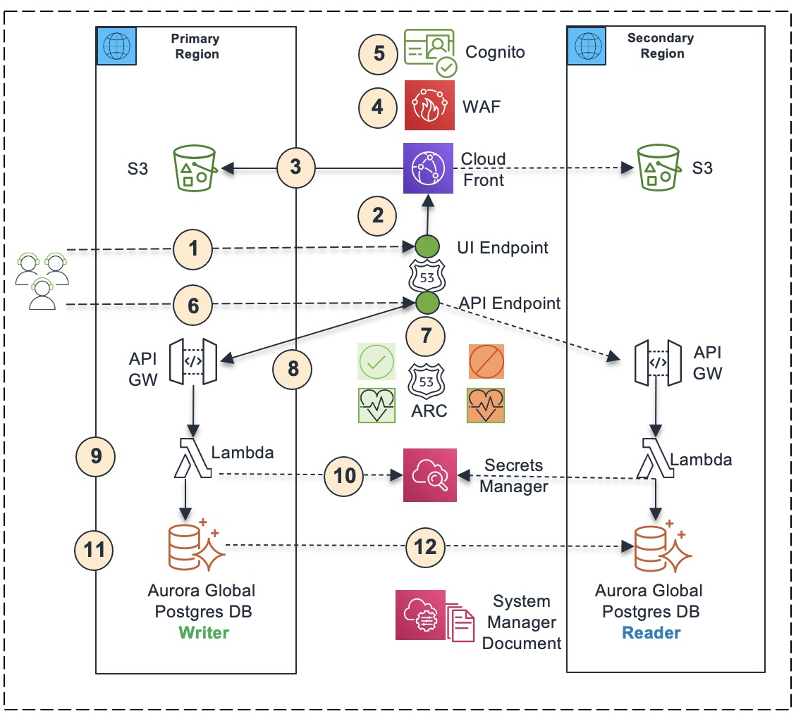
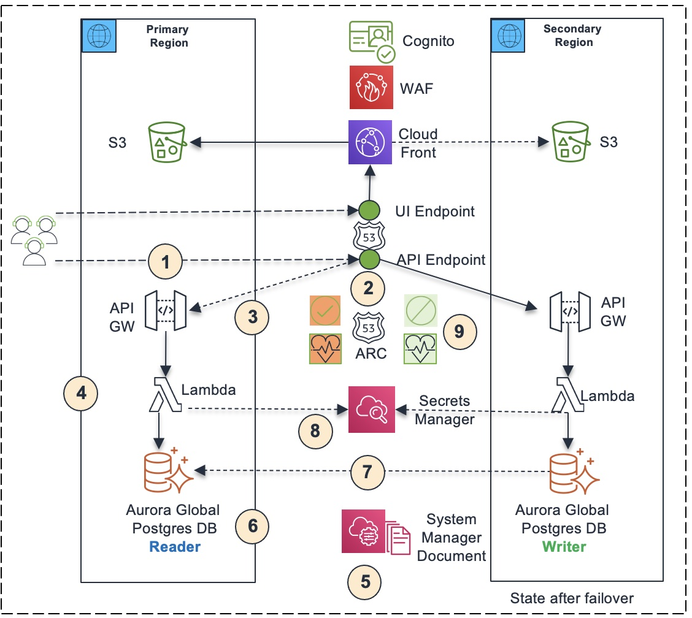
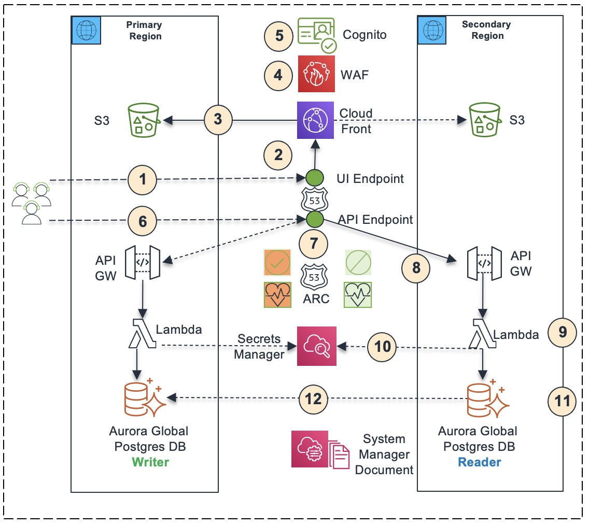
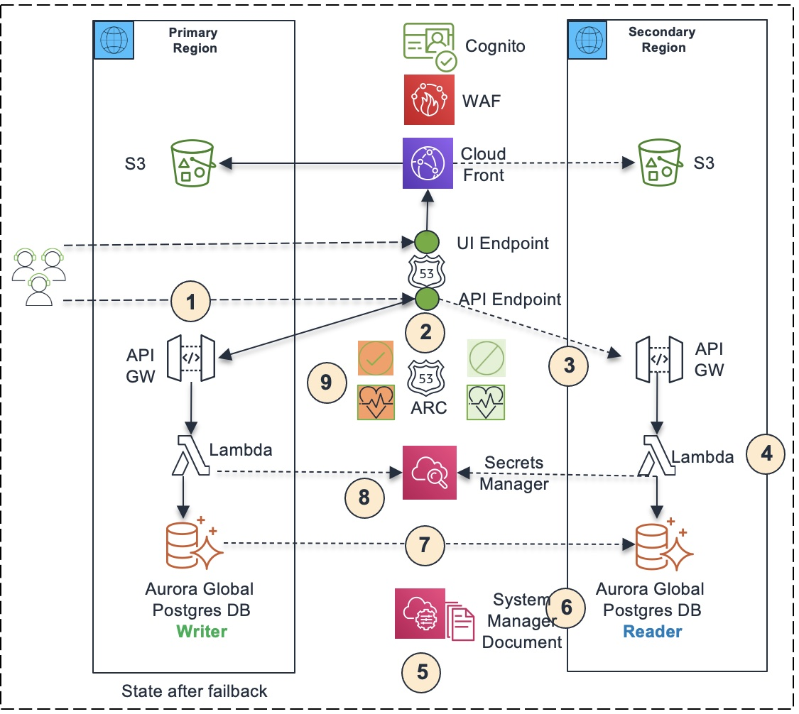
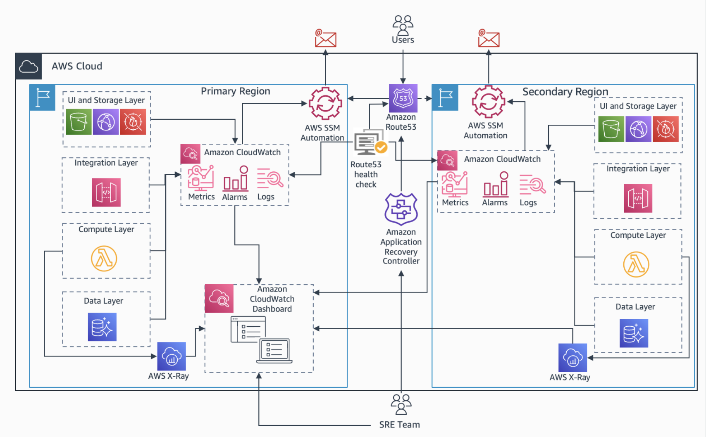

# Cross Region Fail Over, Fail Back and Observability

## Getting started

This guidance helps customers design a resilient three-tier web application (React front end, API/Lambda middle tier and Aurora global database back end) deployed across two regions that can failover and failback from one region to another region in an automated fashion using the active and warm stand-by disaster recovery pattern. The solution also provides guidance on designing observability instrumentation for a multi-region architecture using Amazon CloudWatch to obtain deeper insights from application stacks and aggregate them with relevant infrastructure metrics to help decide whether to failover the application from one region to another. It leverages Amazon Route 53 application recovery controller to route traffic between regions and automates failover using AWS Systems Manager documents.  
## Architecture

The guidance is clarified through a workload for remittance processing application that keeps track of "Money Transfer" transactions. The UI for the application is implemented using [Amazon CloudScape](https://cloudscape.design/) react framework with the web content hosted in [Amazon Simple Storage Service - Amazon S3](http://aws.amazon.com/s3). [Amazon CloudFront](https://aws.amazon.com/cloudfront/) is used to enable fast, low latency access to the web content. Service APIs are implemented using [AWS Lambda](http://aws.amazon.com/lambda) and exposed to internet through [Amazon API Gateway](https://aws.amazon.com/api-gateway/). The application state is stored in [Aurora PostgreSQL](https://aws.amazon.com/rds/aurora/) database. [Amazon Cognito](https://aws.amazon.com/cognito/) is used to enable secure sign-on of the users of the sample application. [AWS WAF](https://aws.amazon.com/waf/) is used to secure the UI and API endpoints from security threats. 

In order to support Disaster Recovery, the workload is architected to be multi-region with Active and Warm Standby DR pattern. Data is kept in-sync between regions using [Aurora PostgreSQL global database](https://docs.aws.amazon.com/AmazonRDS/latest/AuroraUserGuide/aurora-global-database.html). To understand more about different disaster recovery strategies, refer to the [Disaster Recovery of Workloads on AWS](https://docs.aws.amazon.com/whitepapers/latest/disaster-recovery-workloads-on-aws/disaster-recovery-workloads-on-aws.html) whitepaper. 

To recover from a disaster event, the workload will be switched to a new region leveraging [Amazon Route 53](https://aws.amazon.com/route53/). In order to detect a disaster event, logs and metrics are collected using [Amazon CloudWatch](https://aws.amazon.com/cloudwatch/) and dashboard generated to monitor the health of the workload. In case of a disaster event, the switching of the workload to the new region is automated using [AWS System Manager](https://aws.amazon.com/systems-manager/) documents.

### 1. Application Running in Primary Region


1. The user opens the browser and enters the UI DNS endpoint hosted on Route 53 (https://remittanceui.xyz.com). Route 53 is a global service. The data plane for Route 53 is globally available.
2. It gets routed to the CloudFront instance. The CloudFront is a global service. The data plane for CloudFront is globally available.
3. The CloudFront instance delivers UI static content stored in S3 buckets in primary region or secondary region in failover mode. It primarily delivers UI static content from S3 bucket in primary region. If it is not available, it delivers UI static content from S3 bucket in secondary region.
4. The CloudFront instance is protected by Web Application Firewall (WAF), which is configured with standard rules to protect against common web exploits. WAF is a global service. The data plane for WAF is globally available.
5. The UI is protected by a Cognito user pool configured in primary region by authenticating user login with the Cognito user pool. Cognito is a regional service. If there is degradation or outage in Cognito service in primary, then it may impact application failover. Customers generally leverage their own identity providers and may like to replace Cognito with their own identity provider if necessary.
6. The application running in user’s browser invokes the API DNS endpoint hosted on Route 53 (https://remittance.xyz.com).
7. The Route 53 DNS hosted zone is powered by Route 53 Application Recovery Controller (ARC), which contains an ARC control for primary region and an ARC control for secondary region. The arc controls power the respective health checks, which power the respective DNS records in Route 53 hosted zone. Initially, the primary region ARC control is turned on and the secondary region ARC control is turned off. As a result, the primary region health check becomes healthy and the secondary region health check becomes unhealthy. Consequently, the Route 53 API DNS endpoint resolves to the API endpoint in primary region. 
8. The API endpoint is protected by Cognito and WAF. The API requires the UI to pass the JWT token it receives from Cognito upon authentication in the API header. The API uses a Cognito Authorizer to validate the JWT token with the Cognito user pool. In addition, the API is protected by Web Application Firewall (WAF). 
9. The API endpoint in primary region delegates the invocations to corresponding Lambda functions running in primary region.    
10. Lambda users database credentials (database endpoint, user name, password) stored in secrets manager to connect to the database
11. The application uses an Aurora global database to store application transaction data. Initially, the primary Aurora database cluster is configured as the writer cluster, and the secondary Aurora database cluster is configured as a reader cluster. 
12. The primary Aurora database cluster automatically replicates data to secondary Aurora database cluster, which enables the application to run from the secondary region using the data replicated from primary database cluster to secondary database cluster.

### 2. Cross Region Failover


1. The user clicks the “Failover” button in the UI, which invokes the failover API endpoint hosted on Route 53 (https://remittance.xyz.com). 
2. The Route 53 DNS hosted zone routes to API endpoint in primary region based on the state of Route 53 ARC controls. 
3. The primary API endpoint gets invoked.
4. The primary API endpoint delegates the invocation to corresponding Lambda function running in primary region.
5. The lambda function invokes the Failover Runbook automated as a Systems Manager Document. The runbook automates the three steps involved with the failover process. 
6. The runbook first fails over the Aurora global database from primary region to secondary region, making the database cluster in the secondary region the writer cluster and the database cluster in the primary region the reader cluster. 
7. After failover, the Aurora global cluster is configured to automatically replicate data from database cluster in secondary region (writer) to database cluster in primary region (reader).
8. Then the runbook updates the database secret in secrets manager with the database endpoint of the Arora database cluster in secondary region so that Lambda functions use the new database endpoint to interact with the database.
9. Then the runbook flips the Route 53 ARC controls, turning the ARC control for primary region off and turning ARC control for secondary region on. As a result, the secondary region health check becomes healthy and the primary region health check becomes unhealthy. Consequently, the Route 53 API DNS endpoint resolves to the API endpoint in secondary region. This completes the failover. The application will be live in secondary region, routing API traffic to secondary region that invokes Lambda functions in secondary region, which interacts with Aurora database cluster in secondary region. 

### 3. Application Running in Secondary Region


1. The user opens the browser and enters the UI DNS endpoint hosted on Route 53 (https://remittanceui.xyz.com). Route 53 is a global service. The data plane for Route 53 is globally available.
2. It gets routed to the CloudFront instance. The CloudFront is a global service. The data plane for CloudFront is globally available.
3. The CloudFront instance delivers UI static content stored in S3 buckets in primary region or secondary region in failover mode. It primarily delivers UI static content from S3 bucket in primary region. If it is not available, it delivers UI static content from S3 bucket in secondary region.
4. The CloudFront instance is protected by Web Application Firewall (WAF), which is configured with standard rules to protect against common web exploits. WAF is a global service. The data plane for WAF is globally available.
5. The UI is protected by a Cognito user pool configured in primary region by authenticating user login with the Cognito user pool. Cognito is a regional service. If there is degradation or outage in Cognito service in primary, then it may impact application failover. Customers generally leverage their own identity providers and may like to replace Cognito with their own identity provider if necessary.
6. The application running in user’s browser invokes the API DNS endpoint hosted on Route 53 (https://remittance.xyz.com).
7. The Route 53 DNS hosted zone is powered by Route 53 Application Recovery Controller (ARC), which contains an ARC control for primary region and an ARC control for secondary region. The arc controls power the respective health checks, which power the respective DNS records in Route 53 hosted zone. As part of failover, the secondary region ARC control is turned on and the primary region ARC control is turned off. As a result, the secondary region health check becomes healthy and the primary region health check becomes unhealthy. Consequently, the Route 53 API DNS endpoint resolves to the API endpoint in secondary region. 
8. The API endpoint is protected by Cognito and WAF. The API requires the UI to pass the JWT token it receives from Cognito upon authentication in the API header. The API uses a Cognito Authorizer to validate the JWT token with the Cognito user pool. In addition, the API is protected by Web Application Firewall (WAF). 
9. The API endpoint in secondary region delegates the invocations to corresponding Lambda functions running in secondary region.    
10. Lambda users database credentials (database endpoint, user name, password) stored in secrets manager to connect to the database
11. The application uses an Aurora global database to store application transaction data. As part of failover, the Aurora database cluster in secondary region is configured as the writer cluster, and the Aurora database cluster in primary region is configured as a reader cluster. 
12. The Aurora database cluster in primary region automatically replicates data to Aurora database cluster in secondary region, which enables the application to run from the primary region using the data replicated from database cluster in secondary region to database cluster in primary region.

### 4. Cross Region Failback


1. The user clicks the “Failover” button in the UI, which invokes the failover API endpoint hosted on Route 53 (https://remittance.xyz.com). 
2. The Route 53 DNS hosted zone routes to API endpoint in secondary region based on the state of Route 53 ARC controls. 
3. The secondary API endpoint gets invoked.
4. The secondary API endpoint delegates the invocation to corresponding Lambda function running in secondary region.
5. The lambda function invokes the Failover Runbook automated as a Systems Manager Document. The runbook automates the three steps involved with the failover process. 
6. The runbook first fails over the Aurora global database from secondary region to primary region, making the database cluster in the primary region the writer cluster and the database cluster in the secondary region the reader cluster. 
7. After failover, the Aurora global cluster is configured to automatically replicate data from database cluster in primary region (writer) to database cluster in secondary region (reader).
8. Then the runbook updates the database secret in secrets manager with the database endpoint of the Arora database cluster in primary region so that Lambda functions use the new database endpoint to interact with the database.
9. Then the runbook flips the Route 53 ARC controls, turning the ARC control for primary region on and turning ARC control for secondary region off. As a result, the primary region health check becomes healthy and the secondary region health check becomes unhealthy. Consequently, the Route 53 API DNS endpoint resolves to the API endpoint in primary region. This completes the failback. The application will be live in primary region, routing API traffic to primary region that invokes Lambda functions in primary region, which interacts with Aurora database cluster in primary region. 


### 5. Deep Application Observability

Application and dependencies specific observability is important to enable automated/manual failover. In this solution we will also demonstrate observability instrumentation in applications to obtain deeper insights from application stacks and aggregate with infrastructure metrics to trigger failover.

This Observability solution includes creating CloudWatch Dashboard with AWS Health and Metrics at both application and infrastructure layer. Architecture for this solution is as below:




## Pre-requisites
To deploy this example guidance, you need an AWS account, and a user identity with access to the following services:
* Amazon API Gateway
* Amazon Aurora PostgreSQL
* Amazon CloudFront
* Amazon CloudWatch
* Amazon Cognito
* Amazon Lambda
* Amazon Simple Storage Service
* Amazon Route 53
* Amazon Virtual Private Cloud (VPC)
* AWS Identity and Access Management (IAM)
* AWS Secrets Manager
* AWS System Manager
* AWS Web Application Firewall

We suggest using a temporary or a development account to test this guidance. 

You should also have familiarity with using the AWS CLI, including configuring the CLI for a specific account and region profile.  If not, please follow the [CLI setup instructions](https://github.com/aws/aws-cli).  Make sure you have a default profile set up; you may need to run `aws configure` if you have never set up the CLI before. Alternately, you can initialize an AWS session in your terminal using STS tokens provisioned by the administrator.

**NPM**: Please make sure you have npm installed on your machine for building the UI application. 

### CloudFormation

This guidance uses the [AWS CloudFormation](https://aws.amazon.com/cloudformation/).  In order to support multi-region deployment, StackSets feature of CloudFormation is used. To get a better understanding of StackSets refer document [Working with AWS CloudFormation StackSets](https://docs.aws.amazon.com/AWSCloudFormation/latest/UserGuide/what-is-cfnstacksets.html).

### Regions

This demonstration by default uses `us-east-1` as the primary region and `us-west-2` as the backup region.  You can modify these regions by updating the make file.

## Deployment

For the purposes of this workshop, we deploy the CloudFormation Templates and StackSets manually.  For a production workload, you'd want to have an automated deployment pipeline.  As discussed in this [article](https://aws.amazon.com/builders-library/automating-safe-hands-off-deployments/?did=ba_card&trk=ba_card), a multi-region pipeline should follow a staggered deployment schedule to reduce the blast radius of a bad deployment.  Take particular care with changes that introduce possibly backwards-incompatible changes like schema modifications, and make use of schema versioning.

For users interested in learning about observability setup under the hood, they can refer to the readme file in the Observability folder [Readme]

## Configuration
Before starting deployment process please update the following four variables in the Makefile.

**ENV** - It is the unique variable that indicates the environment name. Global resources created, such as S3 buckets, use this name. (ex: devx)

**DOMAIN_NAME** - Please provision a root domain name (ex: root.xyz.com) either using Route 53, a third party vendor or company provided tool. Specify the subdomain name to create under it. (ex: remittance.root.xyz.com)

**UI_DOMAIN_NAME** - Please provision a root domain name (ex: root.xyz.com) either using Route 53, a third party vendor or company provided tool. Specify the subdomain name to create under it. (ex: remittanceui.root.xyz.com)

**ADMIN_EMAIL** - The admin email id used to create a user in cognito. (ex: joejane@xyz.com)

## Deployment Steps

We use make file to automate the deployment commands. The make file is optimized for Mac. If you plan to deploy the solution from another OS, you may have to update few commands.

1. Deploy Base Infrastructure - Roles, Buckets, Network, Database, Route 53 etc.
    ```
    make deploy-base
    ```
   
2. Open hosted zone record for root domain and create 2 NS Records pointing to NS details of "remittance.rootdomain" hosted zone and "remittanceui.rootdomain" hosted zone
    [Reference: https://aws.amazon.com/premiumsupport/knowledge-center/create-subdomain-route-53/](https://aws.amazon.com/premiumsupport/knowledge-center/create-subdomain-route-53/)

3. Deploy App - Cloudfront, Cognito, APIs, CloudWatch, Web App,  etc.
    ```
    make deploy-app
    ```

4. Manually open API Gateway on management console, open "remittance" API and run "CreateDatabaseTable" API to create the database table

5. Manually open Route 53 Application Recovery Controller, open "Remittance-ControlPanel", select "Remittance-Region1", click "Change routing control states", change the state to "On" and save it

6. Go to "us-east-1" and find the admin user password in "crf-cognito-admin-password" in secrets manager

7. Open the application using the UI_DOMAIN_NAME set at the top of the make file and login with admin user email id and admin password

Once the above steps have completed, we should have all the key components of the workload deployed in the primary and DR region as specified in the architecture.

## Verify the deployment

1. Open the application following the UI_DOMAIN_NAME set at the top of make file
2. Enter the admin email provided in make file and password identified in step 6 above
3. This should log you into the application 
4. Click on "Open Remittance Dashboard" link to open the application
5. You should enter the application and see no remittance records
6. Click on the "Create Remittance" button to launch the form, enter requested info to create a remittance
7. Once you submit a form you should see one remittance in the summary dashboard
8. Click on "Failover" button to initiate failover
9. This should execute the "FailoverRunbook" SSM Document
10. Open the "FailoverRunbook" execution by opening Systems Manager and selecting "Automations" from the left menubar
11. Wait for the runbook to complete
12. Open the application following the UI_DOMAIN_NAME set at the top of make file
13. Enter the admin email provided in make file and password identified in step 6 above
14. This should log you into the application 
15. You should see one remittance in the remittance dashboard


